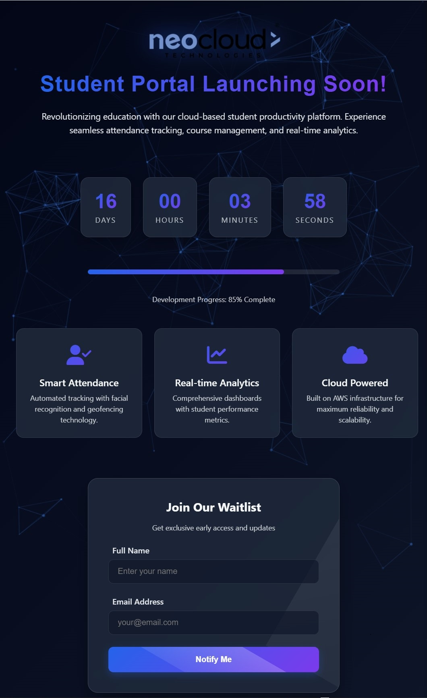

# NEO Cloud Student Portal - Coming Soon

A stunning coming soon page for the NEO Cloud Technologies Student Portal, featuring interactive elements, particle animations, and a countdown timer.

## ✨ Features

- **Interactive Particle Background** - Dynamic particle.js animation that responds to user interactions
- **Countdown Timer** - Launch date countdown with 3D hover effects
- **Glassmorphism UI** - Modern frosted glass design elements
- **Animated Form** - With confetti celebration on submission
- **Feature Showcase** - Interactive feature cards with icons
- **Responsive Design** - Fully responsive across all device sizes
- **Toast Notifications** - Beautiful notification system

## 🛠 Technologies Used

- HTML5, CSS3, JavaScript
- [Particle.js](https://vincentgarreau.com/particles.js/) - For the interactive background
- [Font Awesome](https://fontawesome.com) - For icons
- Google Fonts (Orbitron) - For typography

## 📁 File Structure
